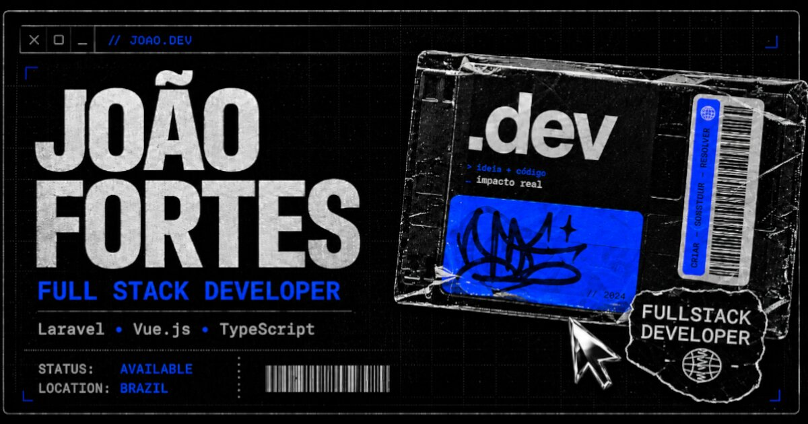

<p align="center">
  <a href="https://joaofortes.dev">
    
  </a>
</p>

<h1 align="center">// JOAO.DEV</h1>

<p align="center">
  <strong>FULL STACK DEVELOPER · SOFTWARE ENGINEERING</strong>
</p>

<p align="center">
  
  
  
  
  
</p>

<p align="center">
  <a href="https://joaofortes.dev">Website</a> ·
  <a href="https://github.com/askuovye">GitHub</a> ·
  <a href="https://www.linkedin.com/in/joaolopesfortes/">LinkedIn</a>
</p>

```text
╭──────────────────────────────────────────────╮
│ SYSTEM                                       │
├──────────────────────────────────────────────┤
│ STATUS      ONLINE                           │
│ TYPE        PERSONAL PORTFOLIO               │
│ STACK       VUE · TYPESCRIPT · VITE          │
│ LOCATION    BRAZIL                           │
│ DOMAIN      joaofortes.dev                   │
╰──────────────────────────────────────────────╯
```

`SYSTEM://ABOUT ────────────────────────────────────────`

## // ABOUT

JOAO.DEV não é apenas uma página com cards. É uma interface autoral que apresenta projetos, experiências e identidade técnica como partes de um mesmo sistema.

O design combina referências de interfaces antigas, software dos anos 2000, elementos físicos e digitais, colagem e experimentação visual — traduzidas para uma experiência web responsiva e funcional.

`SYSTEM://LIVE ─────────────────────────────────────────`

## // LIVE

<p align="center">
  <a href="https://joaofortes.dev">
    
  </a>
</p>

<p align="center"><strong><a href="https://joaofortes.dev">https://joaofortes.dev</a></strong></p>

```text
HTTP        200
HTTPS       ENABLED
SEO         READY
I18N        PT-BR / EN
RESPONSIVE  YES
```

`SYSTEM://STACK ────────────────────────────────────────`

## // STACK

<p align="center">
  
  
  
  
  
  
  
  
  
  
  
  
  
</p>

| MODULE | TECHNOLOGIES |
| --- | --- |
| FRONTEND | Vue.js · TypeScript · Vite · SCSS |
| BACKEND | PHP · Laravel |
| DATABASE | PostgreSQL · MySQL |
| TOOLS | Docker · Git |

### INTERFACE / MOTION

`GSAP + ScrollTrigger` · `Motion for Vue` · `ScrollyVideo` · `Iconify`

`SYSTEM://FEATURES ─────────────────────────────────────`

## // FEATURES

```text
MODULES_LOADED: 08
STATUS: ALL SYSTEMS OPERATIONAL

[01] RESPONSIVE INTERFACE
[02] PT-BR / EN WITH PERSISTED LANGUAGE SELECTION
[03] ROUTE-SPECIFIC SEO METADATA AND CANONICAL URLS
[04] OPEN GRAPH, TWITTER CARDS, JSON-LD, SITEMAP AND ROBOTS
[05] CUSTOM 404 WITH NOINDEX HANDLING
[06] INTERACTIVE PROJECT PLAYER AND CAREER INTERFACES
[07] LAZY-LOADED ROUTES AND MEDIA-AWARE PLAYBACK
[08] MOTION WITH REDUCED-MOTION SUPPORT
```

`SYSTEM://STRUCTURE ────────────────────────────────────`

## // PROJECT_STRUCTURE

```text
src/
├── animations/       # GSAP and motion configuration
├── assets/           # images, videos and fonts
├── components/       # page sections and reusable UI
│   ├── about/
│   ├── contact/
│   ├── experiences/
│   ├── home/
│   ├── projects/
│   └── ui/
├── composables/      # media, motion and loading behavior
├── data/             # projects, experiences and stack
├── i18n/             # PT-BR and EN messages
├── router/           # application routes
├── seo/              # route and locale metadata
├── styles/           # global SCSS foundation
└── views/            # route-level compositions
```

`SYSTEM://BOOT ─────────────────────────────────────────`

## // LOCAL_BOOT

```bash
git clone https://github.com/askuovye/Portifolio.git
cd Portifolio
npm install
npm run dev
```

```bash
npm run type-check
npm run test:unit -- --run
npm run build
```

<details>
<summary><strong>// I18N_SYSTEM</strong></summary>

```text
LOCALES      PT-BR · EN
PERSISTENCE  LOCAL STORAGE
DOCUMENT     html lang UPDATED
SEO          LOCALIZED BY ROUTE
```

</details>

`SYSTEM://AUTHOR ───────────────────────────────────────`

## // AUTHOR

```text
NAME       João Fortes
ROLE       Full Stack Developer
COUNTRY    Brazil
STATUS     Available
```

<p align="center">
  <a href="https://joaofortes.dev"></a>
  <a href="https://github.com/askuovye"></a>
  <a href="https://www.linkedin.com/in/joaolopesfortes/"></a>
</p>

<p align="center"><code>// DESIGN + CODE + CREATE</code></p>
